# May 12

Spent time relearning how to use kicad and sourcing information and schematic/pcb footprints. designed the first half of one side of the split & modular keyboard. 

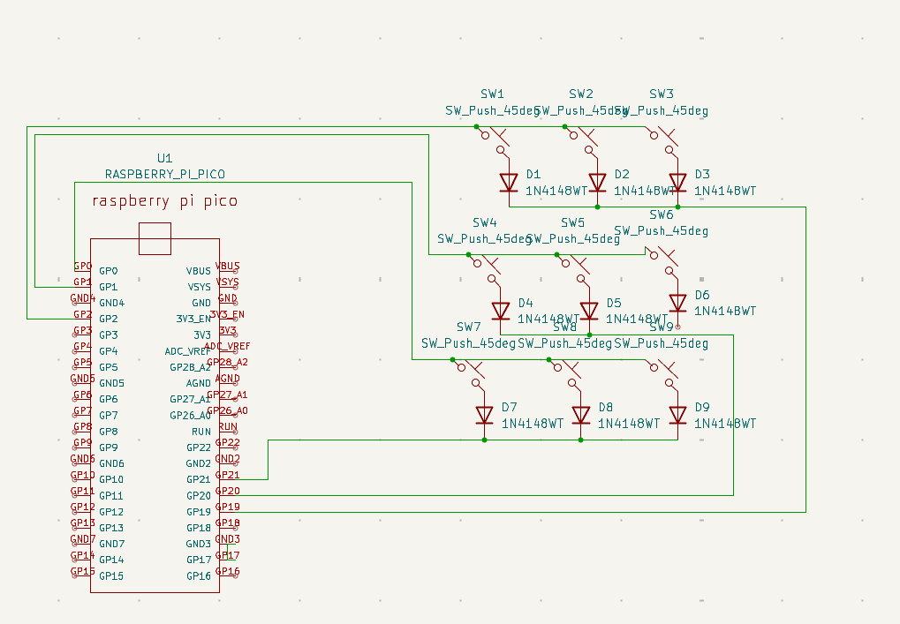
Total time spent: 56 Minutes

# Jun 4
Had to rewrite the Schematics as during the first run the same input gpio buttons were also connected to the same gpio output which would result in 9 keys where 3 keys would be unique with 3 buttons per key. 2nd I was able to add space for an 8 pin magnetic connector on the pcb for the modular part of the keyboard as i wanted the keyboard to be one version for steno and an enitrely different on based on the StenoKeyboards Uni V4 and Polyglot. I made the left half of the pcb then made a second one reversed to create 2 halves of the keyboard. I also sourced the magnetic 8 prong connectors in order to figure out if it should be included in the PCB or whether I need to find a new solution.
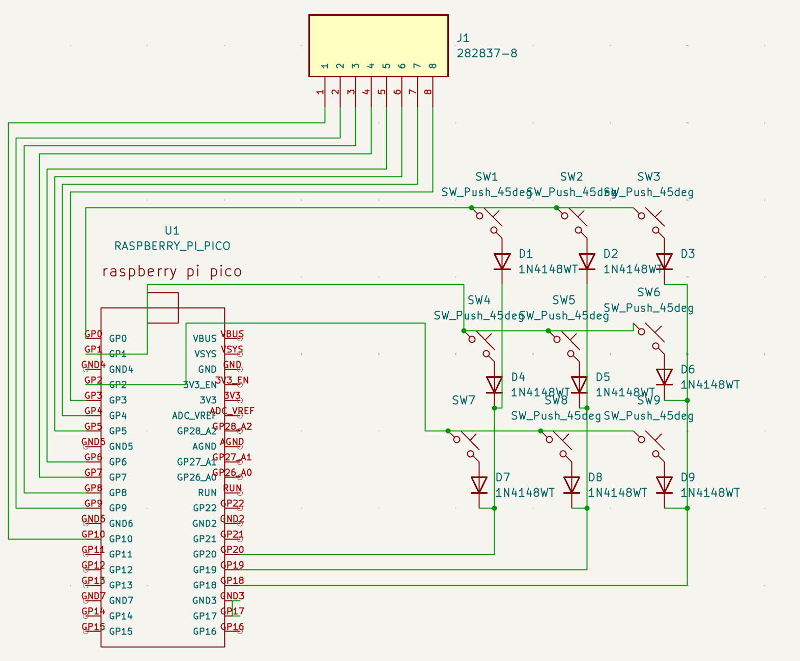
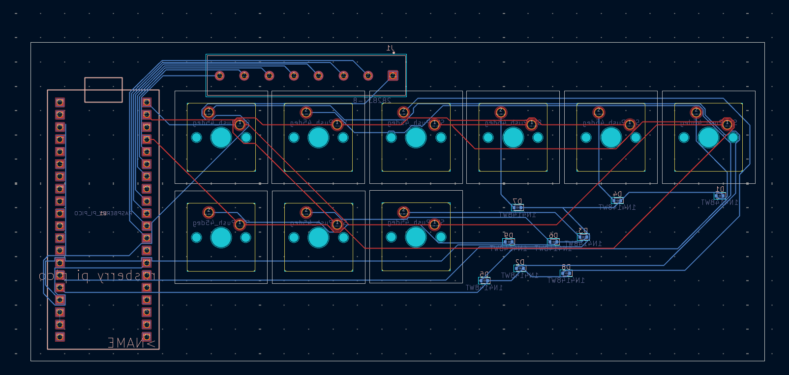
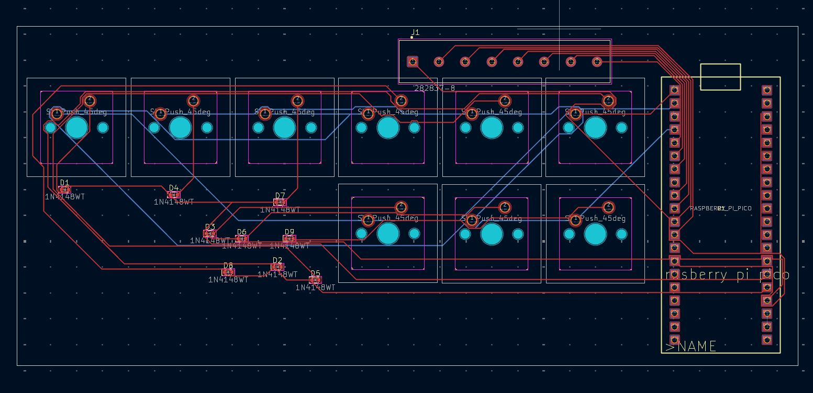
Total time spent: 79 Minutes

# Jun 5
Realized that the Right Hand Side wasn't what i wanted and had to determine how to fix it. If I kept it the way it was the gpio pins wouldn't connect to the buttons i wanted them to connect to which could result in problems. Had to do some research to determine how to do it how I wanted but eventually found a successful method after trial and error. Have to finish some routing still but mostly complete
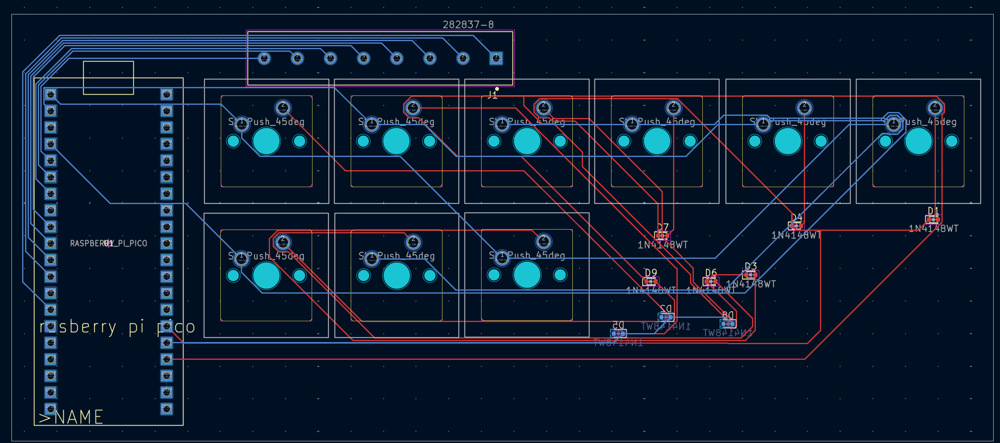
Total time spent: 38 Minutes

# Jun 7
Finished up the right side pcb Routing as i thought it would take 30 minutes so i decided to wait for another day to avoid burnout. I finished the first stage of designing now I sent the current project to see if anyone is available to give feedback. Plan to Work on Code for some time or untill someone provideds feedback on the pcb.
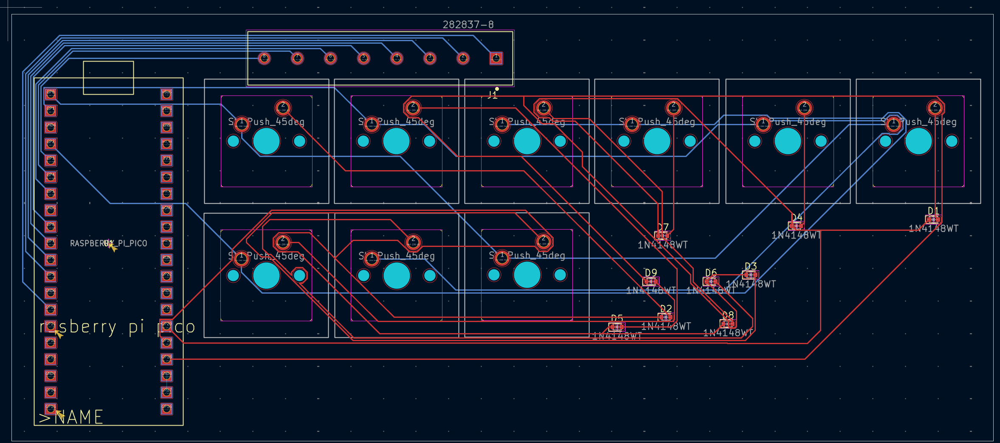
Total time spent: 5 Minutes

# Jun 8
Wanted to start on the QMK programming so i spent some time learning how to implement it into the PCB. While learning i determined that I forgot to add an additional 5 keys which would mean that the keyboard couldn't do stenography in its detached mode. Modified the schematics to include the 5 additional keys then started on the Wiring on the Left side. Finished the wiring on the Left side but plan to leave the right side for Tommorow as it is late and I want to avoid burnout in order to be able to work on the projects consistantly vs big bursts.
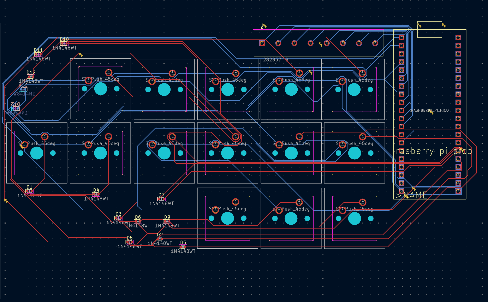
Total time spent: 72 Minutes

# Jun 9
Finished wiring the Right side of the PCB and also decided to review all of the warnings on both sides to prevent any future problems.

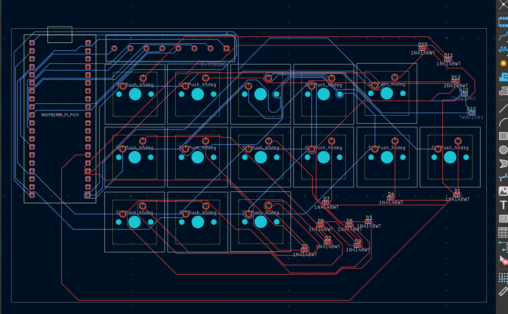
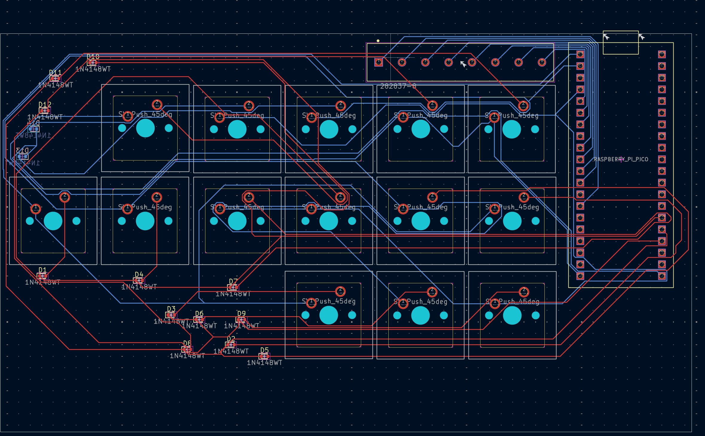
Total time spent: 65 Minutes

# Jun 10
Worked and finished both the extension pcbs of the keyboard. The Wiring and PCB placement was simpler and faster than usual die to the simpler design of the extension board. Plan to work on firmware next.

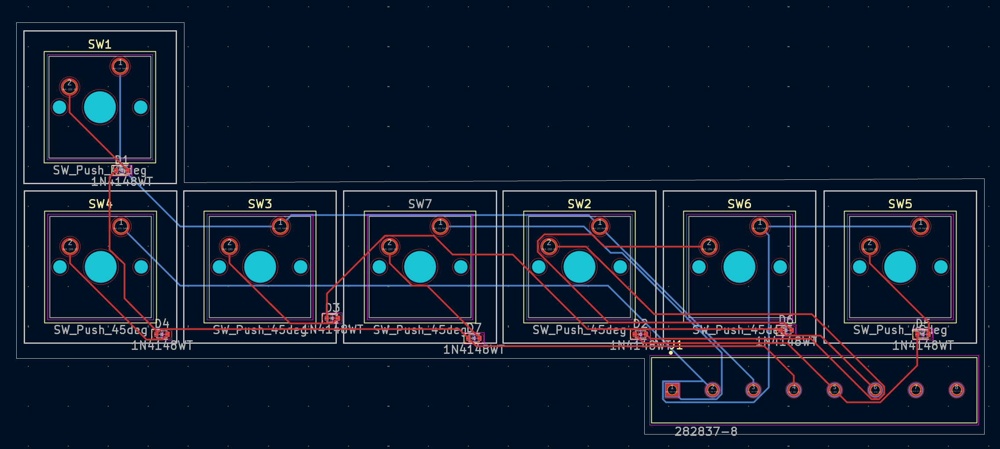
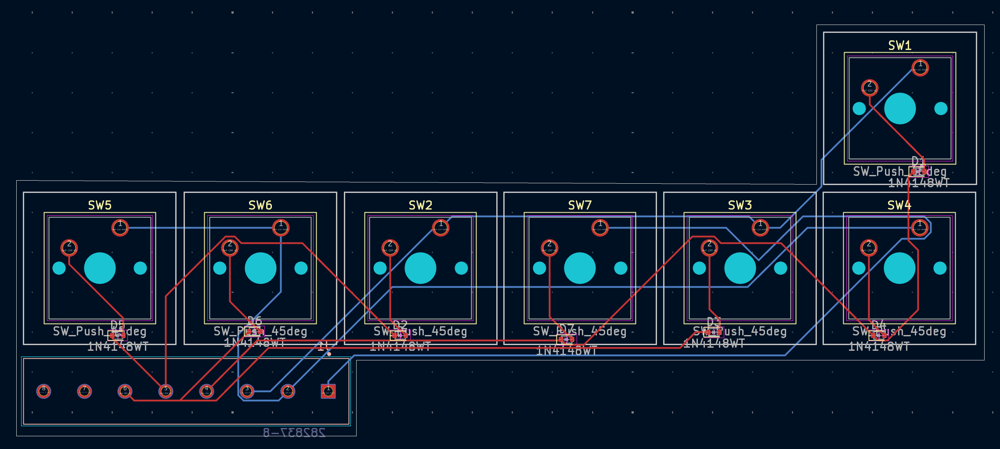
Total time spent: 54 Minutes

# Jun 18
Finally got the chance to work on firmware and created the rough outline of the code in QMK, also learned that i need to create new port on the pcb so that the 2 halfs can connect to one another. Spent a lot of time learning how to add a second type c port to the pcb so that I can connect the 2 halves together.
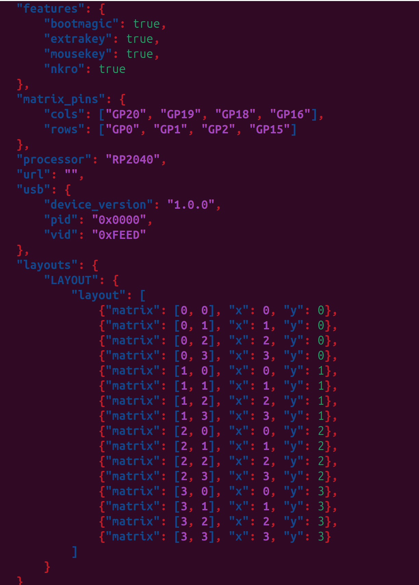
Total time spent: 40 Minutes

# Jun 25
More Reasearch into adding a type C in order to connect the 2 picos together then then modified the schematic and pcbs. 
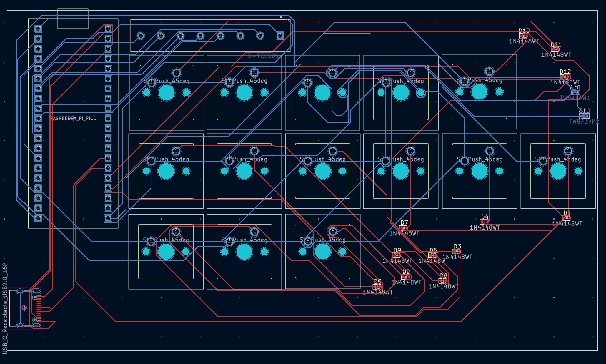
Total time spent: 60 Minutes

#Jun 29
Finished a QMK firmware that succesfully compiles and should have all the required features of the kayboard. Also worked on a case for the left side of the kayboard and have a mostly finished version of the case.

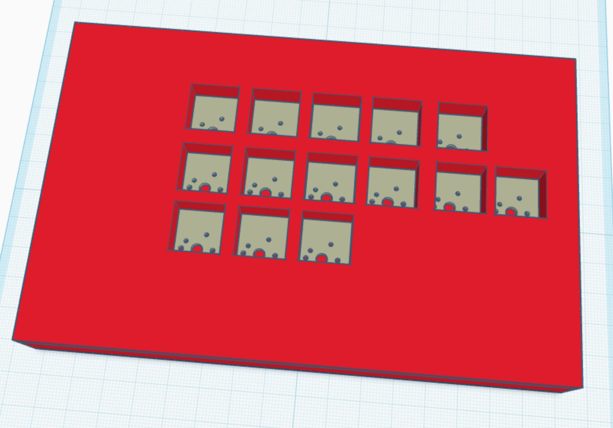
Total time spent: 50 Minutes
